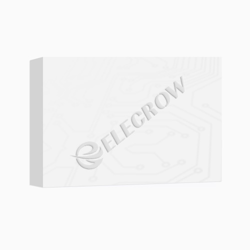
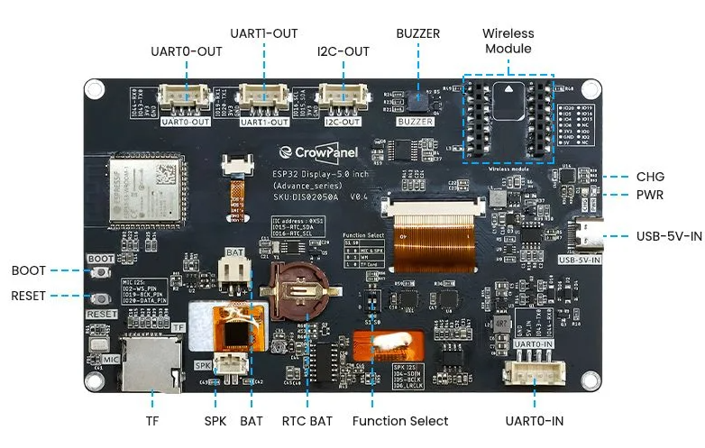

<p align="center">
  <h1 align="center">CrowPanel Advance 5" (DIS02050A v1.1)<br>Dual-Boot LoRa Mesh Firmware</h1>
  <p align="center">
    Run <b>MeshCore</b> or <b>Meshtastic</b> on your CrowPanel — switch at boot, no reflashing.
  </p>
  <p align="center">
    
    
    
    
  </p>
</p>

---

## Hardware

<p align="center">
  <a href="https://www.elecrow.com/crowpanel-advance-5-0-hmi-esp32-ai-display-800x480-ips-artificial-intelligent-touch-screen.html">
    
    &nbsp;&nbsp;
    
  </a>
</p>

<p align="center">
  <b>Elecrow CrowPanel Advance 5.0" HMI</b> — <a href="https://www.elecrow.com/crowpanel-advance-5-0-hmi-esp32-ai-display-800x480-ips-artificial-intelligent-touch-screen.html">Product Page</a>
</p>

| Component | Specification |
|-----------|--------------|
| **Board** | Elecrow CrowPanel Advance 5.0" (DIS02050A v1.1) |
| **MCU** | ESP32-S3 (8MB Flash, PSRAM) |
| **Display** | 5" 800x480 IPS, capacitive touch (GT911) |
| **Radio** | SX1262 LoRa transceiver |
| **Connectivity** | WiFi + Bluetooth (built-in) |

---

## Overview

This project turns the **CrowPanel Advance 5"** into a standalone LoRa mesh communicator with a full touchscreen UI. A boot selector lets you choose which firmware to run at startup — no cables, no reflashing.

| Firmware | Description |
|----------|-------------|
| **MeshCore** | Feature-rich mesh chat with a dark-themed LVGL touchscreen UI built entirely from scratch, with original features and WiFi functionality (Telegram bridge, web dashboard, web interface for PC control). |
| **Meshtastic** | The popular open-source LoRa mesh platform, ported with minimum changes to work with the CrowPanel's wiring. Due to wiring constraints, some features (e.g. maps) do not work. |
| **Boot Selector** | Simple touchscreen menu at startup to pick your firmware. Remembers your last choice. |

---

## MeshCore Features

| Feature | Details |
|---------|---------|
| **Custom UI** | Built from scratch with LVGL 8.3 — dark theme, portrait & landscape, Greek/English keyboards |
| **Private Messages** | Per-message delivery tracking with automatic retries |
| **Channels** | Group messaging with receipt confirmation |
| **Web Interface** | Full web dashboard accessible from any browser on your PC or phone — view contacts, channels, messages, and send/receive over WiFi |
| **Telegram Bridge** | Channels forwarded to group topics, PMs to private bot chat, bidirectional messaging from Telegram |
| **Contacts & Repeaters** | Full contact and repeater management with signal routing |
| **WiFi + NTP** | Time sync and connectivity for all bridge and web features |

---

## Quick Start

### Prerequisites

- [PlatformIO](https://platformio.org/) (CLI or VS Code extension)
- Python 3 (included with PlatformIO)
- USB-C cable

### Hardware Setup

> **Important: Antenna Pigtail Cable**
>
> Route the LoRa antenna pigtail cable **outside the board** (not folded over the PCB). Keeping the cable away from the electronics significantly reduces floor noise and improves radio performance.
>
> After flashing, use the **Floor Noise** function in the settings to tune and verify your noise level. A lower floor noise means better receive sensitivity and longer range.

### Build & Flash

Clone the repo and use `flash_all.py` to build all three firmwares and flash them:

```bash
git clone https://github.com/kgiannadakis/CrowPanel-DIS02050A.git
cd CrowPanel-DIS02050A
python flash_all.py <PORT>
```

Replace `<PORT>` with your serial port (e.g. `COM20` on Windows, `/dev/ttyUSB0` on Linux, `/dev/cu.usbserial` on macOS).

The dual-boot system requires the specific `partitions.bin` included in the repo root. The bootloader is automatically picked from the Meshtastic build output.

> **Note:** The build and flash process will take several minutes — be patient! The first boot after installation will also be longer than usual.

### Build Individual Projects

If you prefer to flash only one of the two firmwares, build them manually:

```bash
pio run -d meshcore  -e crowpanel_v11_lvgl_chat
pio run -d meshtastic -e elecrow-adv1-43-50-70-tft
```

---

## Web Interface

MeshCore includes a built-in web dashboard for controlling your node from a PC or phone browser:

1. Enable WiFi on the CrowPanel (**Web Apps** screen)
2. Enable the **Web Dashboard** toggle
3. Open `http://<device-ip>` in any browser on the same network

From the web interface you can:
- View all contacts, channels, and repeaters
- Read message history
- Send private messages and channel messages
- Monitor device status (uptime, signal, battery)
- Delete repeaters

---

## Telegram Bridge

Bridge your mesh conversations to Telegram with organized threading:

**Setup:**
1. Create a bot via [@BotFather](https://t.me/BotFather)
2. Create a Telegram group with Topics enabled, add the bot as admin
3. Enter bot token and group chat ID on the CrowPanel (**Web Apps** screen)
4. Send `/start` to the bot in a private message to link PMs

**How it works:**
- Each mesh **channel** gets its own topic thread in the Telegram group
- **PMs** go to your private chat with the bot (only you can see them)
- Send from Telegram: `/pm ContactName message` or `/ch ChannelName message`

---

## Repository Structure

```
CrowPanel-DIS02050A/
├── meshcore/        MeshCore firmware (PlatformIO project)
├── meshtastic/      Meshtastic firmware (PlatformIO project)
├── selector/        Boot selector firmware (PlatformIO project)
├── partitions.bin   Dual-boot partition table (pre-built)
├── flash_all.py     Build & flash script
└── LICENSE          GPL-3.0
```

---

## Acknowledgments

- [Meshtastic](https://meshtastic.org/) — Open-source LoRa mesh networking
- [MeshCore](https://github.com/rmendes76/MeshCore) — LoRa mesh chat framework
- [Elecrow](https://www.elecrow.com/) — CrowPanel hardware
- [LVGL](https://lvgl.io/) — Embedded graphics library

---

## License

This project is licensed under the **GNU General Public License v3.0** — see [LICENSE](LICENSE).

---

## Disclaimer

I am not a professional programmer. This project is the result of a lot of hard work, manual patches, use of AI tools, and trial and error. Expect some functions not to be perfect. This is maintained in my free time, so updates may be infrequent.

---

## Contributing

Contributions are welcome! Feel free to open issues or pull requests.

If you're adapting this for a different CrowPanel model, the key files to modify are the display driver, pin definitions, and partition table.
